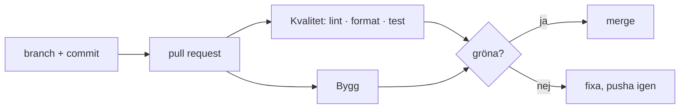

| step | time |
|---|---:|
| npm ci | 5 s |
| lint | 1 s |
| format:check | 0 s |
| test | 2 s |
| build | 1 s |
| Total | 12 s |

Kräv PR-granskning innan merge till main
Kräv att statuskontroller passerar innan merge
Blockera force push för att skydda main
